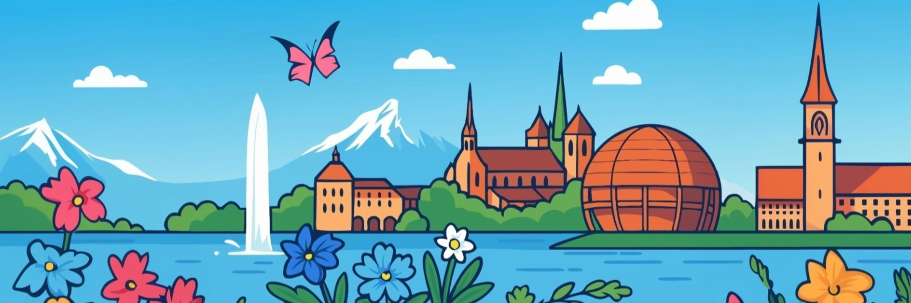

  
  <h1>KCD Suisse Romande 2026</h1>
  <strong>Kubernetes Community Days · 09–10 December 2026 · CERN, Geneva</strong>
    
  <a href="https://kcd.cloud-native-romandy.ch/">🌐 Website</a> ·
  <a href="./#call-for-papers">📋 Call for Papers</a> ·
  <a href="https://cloud-native-romandy.ch/contacts/">💬 Contacts</a>

---

## About This Event

On **09–10 December 2026**, join us at **[CERN](https://home.cern/)** for **Kubernetes Community Days (KCD) Suisse Romande**!

This will be a two-day event focused on cloud native projects and the local community.
Talks will be in both **French and English**. We plan to welcome around **300 participants**.
The event is organized by the [Association Cloud Native Suisse Romande](https://cloud-native-romandy.ch).

KCDs are community-organized events that gather adopters and technologists from open source and cloud native communities for education, collaboration, and networking.
KCDs are supported by the [Cloud Native Computing Foundation (CNCF)](https://www.cncf.io/).

| | |
|---|---|
| 📅 **When** | 09–10 December 2026, 9:00 AM – 9:00 PM (CET) |
| 📍 **Where** | [CERN Science Gateway, 1 Esplanade des Particules, Meyrin 1217](https://maps.google.com/?q=CERN+Science+Gateway+1+Esplanade+des+Particules+Meyrin+1217) |
| 📋 **Call for Papers** | Coming Soon |
| 🎟️ **Registration** | Coming Soon |

---

## Agenda

Preliminary agenda:

### 09 Dec

- Workshops (3+ parallel tracks)
- Optional tours to CERN and the LHC
- Speaker Dinner

### Main Day - 10 Dec

- Conference talks 
- After-party

Full agenda will be published on our Sessionize account
before the event.

## Call for Papers

> 📢 The Call for Papers is **coming soon**. Stay tuned on [CNCF Slack `#kcd-suisse-romande`](https://slack.cncf.io/) and our [website](https://kcd.cloud-native-romandy.ch/) for announcements.

## Speakers

> Keynote Speaker announcements coming soon!

## Hosts & Organizers

This event is organized by the [Association Cloud Native Suisse Romande](https://cloud-native-romandy.ch) and all volunteers,
with help from our sponsors and community partners.

## Venue

### Main Day - CERN Science Gateway

The main day will happen at the [CERN Science Gateway](https://visit.cern/science-gateway) -
1 Esplanade des Particules, Meyrin 1217, Switzerland.
[How to get there](https://visit.cern/getting-here).

## Sponsors

Sponsoring opportunities are available!
If you are interested, please reach out via [our contact page](https://cloud-native-romandy.ch/contacts/) or the CNCF Slack `#switzerland` channel.

### Community Partners

| | |
|---|---|
| [Cloud Native Suisse Romande](https://cloud-native-romandy.ch/) | [CNCF](https://www.cncf.io/) |
| [DevopsDays Geneva](https://devopsdays-geneva.ch/) | [Cloud Native Zurich](https://cloudnativezurich.ch/) |
| [Bern Cloud Native](https://cloudnativeday.ch/) | [Silicon Chalet](https://www.meetup.com/silicon-chalet/) |

---

## Chat

* Public: `#kcd-suisse-romande` on the [CNCF Slack](https://slack.cncf.io/)

## References

* [kcd.cloud-native-romandy.ch](https://kcd.cloud-native-romandy.ch/) - main link to the current KCD Suisse Romande event
* [Cloud Native Suisse Romande - Events](https://cloud-native-romandy.ch/events/kcd/) - event logistics page on the association's website

## Previous Editions

* KCD Suisse Romande 2025 - [site](https://community.cncf.io/events/details/cncf-kcd-suisse-romande-presents-kcd-suisse-romande/),
  [talks](https://sessionize.com/view/rlq5we3p/GridSmart)

